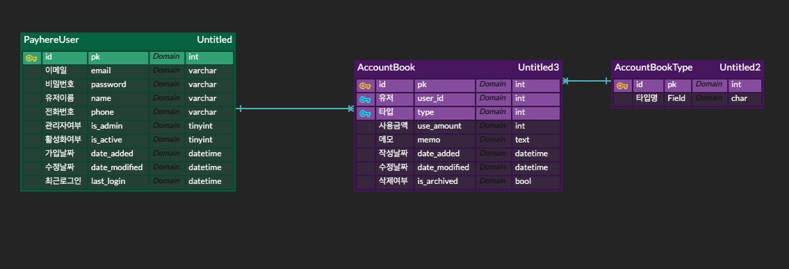

# Payhere_task

## ERD

----



----
### start.sh
```　
cd backend

pip install --upgrade pip
pip install -r requirements.txt


python manage.py makemigrations


python manage.py migrate


python manage.py runserver
```

---

## API

## Swaager path : /swagger

Authorize
Bearer {access_token}


----
<table style="border-collapse: collapse; width: 100%; height: 210px;" border="1" data-ke-align="alignLeft" data-ke-style="style12">
<tbody>
<tr style="height: 19px;">
<td style="width: 25%; text-align: center; height: 19px;">기능</td>
<td style="width: 25%; text-align: center; height: 19px;">Method</td>
<td style="width: 25%; height: 19px; text-align: center;">URL</td>
</tr>
<tr style="height: 17px;">
<td style="width: 25%; height: 17px;"><b>회원가입</b></td>
<td style="width: 25%; height: 17px;">POST</td>
<td style="width: 25%; height: 17px;">/user/register</td>
</tr>
<tr style="height: 19px;">
<td style="width: 25%; height: 19px;">로그인</td>
<td style="width: 25%; height: 19px;">POST</td>
<td style="width: 25%; height: 19px;">/user/login</td>
</tr>
<tr style="height: 17px;">
<td style="width: 25%; height: 17px;">로그아웃 </td>
<td style="width: 25%; height: 17px;">POST</td>
<td style="width: 25%; height: 17px;">/user/logout</td>
</tr>
<tr style="height: 17px;">
<td style="width: 25%; height: 17px;">가계부 작성</td>
<td style="width: 25%; height: 17px;">POST</td>
<td style="width: 25%; height: 17px;">/account-book/register</td>
</tr>
<tr style="height: 17px;">
<td style="width: 25%; height: 17px;">가계부 수정</td>
<td style="width: 25%; height: 17px;">PUT</td>
<td style="width: 25%; height: 17px;">/account-book/{pk}</td>
</tr>
<tr style="height: 17px;">
<td style="width: 25%; height: 17px;"><b>가계부 삭제</b></td>
<td style="width: 25%; height: 17px;">DELETE</td>
<td style="width: 25%; height: 17px;">/account-book/{pk}</td>
</tr>
<tr style="height: 17px;">
<td style="width: 25%; height: 17px;">가계부 리스트</td>
<td style="width: 25%; height: 17px;">POST</td>
<td style="width: 25%; height: 17px;">/account-book/list</td>
</tr>
<tr style="height: 17px;">
<td style="width: 25%; height: 17px;"><b>가계부 디테일</b></td>
<td style="width: 25%; height: 17px;">GET</td>
<td style="width: 25%; height: 17px;">/account-book/{pk}</td>
</tr>
<tr style="height: 17px;">
<td style="width: 25%; height: 17px;"><b>가계부 복제</b></td>
<td style="width: 25%; height: 17px;">POST</td>
<td style="width: 25%; height: 17px;">/account-book/clone/{pk}</td>
</tr>
<tr style="height: 17px;">
<td style="width: 25%; height: 17px;">가계부 공유 URL 생성</td>
<td style="width: 25%; height: 17px;">POST</td>
<td style="width: 25%; height: 17px;">/account-book/share/{pk}</td>
</tr>
<tr style="height: 19px;">
<td style="width: 25%; height: 19px;">가계부 통계</td>
<td style="width: 25%; height: 19px;">GET</td>
<td style="width: 25%; height: 19px;">account-book/stat</td>
</tr>
</tbody>
</table>

---

# API 설계

## User

---
### 회원가입
1. 유저는 name, email, password, phone 을 입력하여 회원가입 요청

    ~~~
    {
        "email":"test@payhere.kr",
        "name":"test",
        "password":"1234",
        "phone":"01000000000"
    }
    ~~~

   1.  이미 존재 하는 Email 일때

      ~~~
      HTTP 400 Bad Request
    
    
      {
          "email": [
              "중복 이메일 입니다"
          ]
      }
      ~~~
2. 회원가입 완료 시 JWT 토큰을 발행 하고 쿠키를 생성 합니다.

3. 비밀번호는 암호화 되어 저장 됩니다.

### 로그인
1. 유저는 email과 password를 가지고 로그인 요청
~~~
{
    '"email":"test@payhere.kr",
    "password":"1234"
}
~~~
 
2. 로그인 완료시 JWT 토큰 발행과 쿠키 생성을 합니다.

### 로그아웃

1. 로그아웃 요청시 로그아웃과 쿠키에있는 token을 제거합니다.

--- 

## Account

### 가계부 작성
1. 유저 가계부 생성 요청 
~~~
{
  "use_amount": 2147483647,
  "memo": "string",
  "user": 0,
  "type": 0
}
~~~
2. permission IsAuthenticated 사용하여 인증된 유저만 사용가능


### 가계부 수정/삭제/상세
1. custom permission [IsAccountOwner] 사용하여 GET이외의 Method는 owner 유저만 사용 가능
2. GET/PUT/PATCH/DELETE 를 가지고 있는 RetrieveUpdateDestroyAPIView 로 설계

### 가계부 리스트
1. permission [IsAuthenticated] 사용하여 인증된 유저만 사용가능
2. get_queryset() 으로 현재 유저의 가계부 리스트만 가지고옴

### 가계부 공유 url 생성
1. django-link-shortener를 사용
2. 공유 하려는 상세 페이지 short-url 생성
3. LIFESPAN을 60초로 설정하여 short-url 만료 시간을 설정 (만료시간 변경 가능)

### 가계부 통계
1. 가계부 관리에 필요한 기능이라 생각하여 설계
2. 유저의 타입별 소비금액, 전체 소비금액 , 타입별 비중 %를 보내줌

---
### 요구사항 미구현

테스트 케이스 미작성
   - 로직 상 일어날 수 있는 다양한 케이스를 작성하여 안정화를 가능하게 할 수 있으나 , 시간적인 리소스 부족으로 미작성 


### 개인 미구현 
1. 이메일 인증 메일 발송
   - 유니크한 이메일을 가지는 모델을 가진 회원가입 기능에 적합한 기능이나, 동기로 처리하기에는 처리시간이 오래걸리는 관계로 실제 서비스에서는 고객 경험 저하유발, celery 와 redis 를 활용하여 비동기로 처리할 계획을 세움

2. 가계부 기간별 리스트 조회 기능
   - 가계부의 중요하다 생각하는 기능 중 하나, 가계부 모델에 date_added를 활용해 처리할 계획을 세움

3. 가계부 날짜 지정 기능
   - 모든 유저가 매일 매일 작성하지 못할 경우가 많음 , 그런 경우를 대비 하기위해 'use_date' column을 추가하여 개발 가능
   
4. SNS 로그인 기능
   - 회원가입 -> 로그인이라는 프로세스를 줄여 사용량을 늘릴 수 있음 , SNS 로그인을 선호하는 유저가 많음


